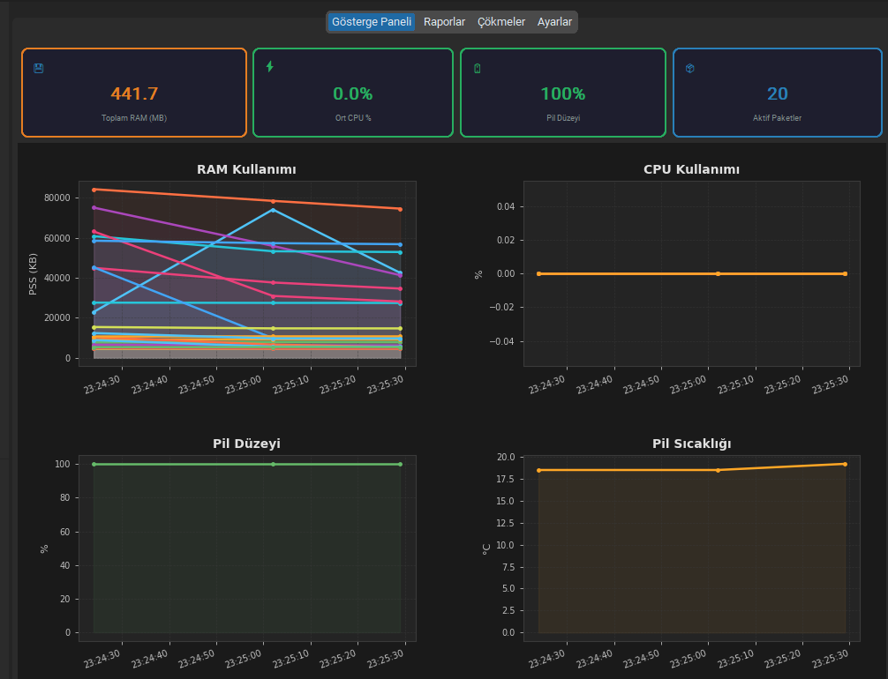

# ADB Telemetry & Health Monitor



A modern desktop application for real-time performance monitoring of Android devices (POS, industrial, mobile) via ADB. Collects CPU, RAM, battery, network, and disk metrics, detects crashes and ANRs, and generates detailed HTML/CSV/PDF reports.

---

## Features

### Monitoring
- **Multi-device support** — monitor several Android devices simultaneously
- **Auto-discovery mode** — automatically detects all running packages on the device
- **Custom package mode** — target specific package IDs for focused monitoring
- **Configurable poll interval** — adjustable metric collection frequency

### Metrics Collected
| Metric | Source |
|--------|--------|
| RAM (PSS) | `dumpsys meminfo` |
| CPU usage (per-process & system) | `top` / `/proc/<pid>/stat` |
| Battery level, temperature, voltage | `dumpsys battery` |
| Battery attribution (mAh per app) | `dumpsys batterystats` |
| Network I/O (RX/TX KB) | `/proc/net/xt_qtaguid/stats` |
| Disk I/O (read/write KB) | `/proc/<pid>/io` |
| Thread count & file descriptors | `/proc/<pid>/status` |

### Crash & ANR Detection
- Background logcat watcher filters `Exception`, `ANR`, `Fatal`, `CRASH` keywords
- Automatic device screenshot on crash/ANR event (`adb shell screencap`)
- Dedicated **Crashes** tab with screenshot viewer

### Alerting
- Threshold-based alerts (RAM KB, CPU %, temperature °C, battery drop %)
- Statistical spike detection (configurable σ multiplier)
- OS desktop notifications via `plyer`
- Webhook / Slack notifications (HTTP POST, Slack Incoming Webhook compatible)

### Reporting
- **HTML report** with embedded Matplotlib charts (RAM, CPU, battery trends)
- **CSV export** with all raw metric rows
- **PDF export** via ReportLab
- **Session comparison** — overlay two CSV sessions on the same chart
- **Time range zoom** — JavaScript slider filter in the HTML report
- **Report tagging** — add name, tags, and notes to each report; searchable
- **Auto-cleanup** — delete reports older than N days

### GUI
- Modern dark-theme desktop app built with **CustomTkinter**
- Live KPI stat cards (total RAM, avg CPU, battery %, active packages)
- Real-time Matplotlib chart panel (embedded in GUI)
- CPU impact ranking panel (top-6 packages by average CPU)
- Package preset system — save and load named package lists
- Wi-Fi ADB connection helper (`adb connect host:port`)
- System tray support — minimize to tray, keep monitoring in background
- Scheduled monitoring — auto-start at a configured time (daily or once)
- **Turkish / English** UI (switchable from Settings)

### CLI / CI-CD
```bash
python run_monitor.py --package com.example.app --duration 120
python run_monitor.py --package com.example.app --fail-on-crash
python run_monitor.py --package com.example.app --output-format json
python run_monitor.py --package com.example.app --alert-threshold ram_kb=512000
```
`--fail-on-crash` exits with code `2` when a crash or ANR is detected — ready for Jenkins / GitHub Actions pipelines.

### Data Storage
- **SQLite backend** — sessions and records stored in `reports/telemetry.db` (WAL mode, thread-safe)
- Parallel CSV write for backward compatibility

---

## Installation

**Requirements:** Python 3.10+, ADB installed and on PATH

```bash
git clone https://github.com/your-username/adb-telemetry-health-monitor.git
cd adb-telemetry-health-monitor
pip install -r requirements.txt
```

---

## Quick Start

### GUI
```bash
python run_gui.py
```

1. Connect your Android device via USB (or Wi-Fi ADB)
2. Click **⟳ Refresh** to detect the device
3. Choose **Auto-Discover** or **Custom Packages** mode
4. Click **▶ Start Monitoring**
5. Click **■ Stop Monitoring** — an HTML report is generated automatically

### CLI
```bash
python run_monitor.py --package com.example.app --duration 60 --interval 5
```

---

## Project Structure

```
├── run_gui.py                  # GUI entry point
├── run_monitor.py              # CLI entry point
├── requirements.txt
├── settings.json               # User config (auto-created on first run)
├── droidperf/
│   ├── adb_manager.py          # ADB command wrapper (subprocess)
│   ├── monitor_engine.py       # Core monitoring loop (threaded)
│   ├── logcat_watcher.py       # Background crash/ANR listener
│   ├── alert_engine.py         # Threshold & spike detection
│   ├── reporter.py             # HTML / CSV / PDF report generation
│   ├── charts.py               # Matplotlib chart rendering (base64 PNG)
│   ├── session_compare.py      # Two-session comparison charts & report
│   ├── db.py                   # SQLite backend (TelemetryDB)
│   ├── notifier.py             # Webhook & OS notification delivery
│   ├── process_discovery.py    # Auto-discover running packages
│   ├── settings_manager.py     # Persistent JSON settings singleton
│   ├── i18n.py                 # Internationalisation (en / tr)
│   └── collectors/
│       ├── memory.py           # RAM PSS
│       ├── cpu.py              # CPU usage
│       ├── battery.py          # Battery level / temp / voltage
│       ├── battery_stats.py    # Per-app mAh attribution
│       ├── network.py          # Network I/O
│       ├── disk_io.py          # Disk read/write
│       └── process_stats.py    # Thread count & file descriptors
├── gui/
│   ├── app.py                  # Main window & layout
│   └── widgets/
│       ├── control_panel.py    # Device selector, mode, start/stop
│       ├── stat_cards.py       # Live KPI strip
│       ├── chart_panel.py      # Embedded Matplotlib canvas
│       ├── ranking_panel.py    # CPU impact ranking (sidebar)
│       ├── report_panel.py     # Report browser (open/compare/pdf/tag)
│       ├── screenshots_panel.py# Crash screenshot viewer
│       ├── settings_panel.py   # Settings editor & preset manager
│       ├── compare_dialog.py   # Session comparison dialog
│       └── wifi_dialog.py      # Wi-Fi ADB connection dialog
└── locale/
    ├── en.json
    └── tr.json
```

---

## Dependencies

| Package | Purpose |
|---------|---------|
| `customtkinter` | Modern dark-theme GUI |
| `matplotlib` | Charts (GUI canvas + HTML reports) |
| `jinja2` | HTML report templating |
| `reportlab` | PDF report generation |
| `pystray` | System tray icon |
| `Pillow` | Tray icon image generation |
| `plyer` | OS desktop notifications (optional) |

---

## License

MIT
